[TOC]

# 程序框架介绍

## 程序需求
- 网络收发报文
- 控制板可复用，通过指令设置工作类型
- 程序整体流程图
  
    

## 用户交互接口
  
  

- 串口，需连接串口模块（舵轮控制板后期无法使用该接口）
  - 115200 1 8 None
  - 指令示例(结尾必须增加**空格**，方便解析)
  
        ip:192.168.0.199 type:4 freq:100 
  - 配置信息写入eeprom，掉电后不失效
  - 超时时间可调整 CMD_TIMEOUT(Core/main.h)，目前默认为5s
  - 启动网络服务前，会打印板配置信息
  - 如需打印调试信息，使用print(char str);
- 网口，全程可用
  - 5001端口
    - 支持网络配置，数据解析成功后写入eeprom，提示掉电重启生效，掉电前仍以当前控制板类型工作
    - 指令示例(结尾必须增加**空格**，方便解析)
  
            ip:192.168.0.199 type:4 freq:100 
    - 如需打印调试信息，使用eprint(char str); (方便串口 网口共同)
  - 5000端口
    - 按配置周期进行数据上报
    - 接收用户发送的指令信息
    - 指令信息格式参考示例代码(发送指令结尾必须增加**空格**，方便控制板解析不同包；上报的数据包增加了```\r\n```，方便上位机解包；其他类型控制指令参考[网络通信协议](#网络通信协议))

            io_state:0 ts:0 

# 工程介绍
##  应用程序（App）
   -  adsorption_fan_tsk
      -  风机控制任务，为方便兼容主动吸附和普通吸附，单独创建任务
         -  定时器捕获计算转速，利用freertos notify特性进行数据传输，保障中断与任务间的共享数据同步
         -  ADC采集真空度，为方便兼容主动吸附和普通吸附，单独使用ADC2，只有一个通道，未使用dma
         -  控制量、真空度已考虑符号，使用正值控制、反馈
         -  周期接收5000端口控制指令，更新控制量
         -  周期性更新pwm，控制风机
         -  周期提供风机反馈数据给5000端口
   -  adsorption_motion_tsk
      -  吸附单元控制任务
         -  平板姿态解算为位移（解算的前提条件参考Core/Inc/physparams.h）
            - 对位移传感器的位置定义如下，z轴以指向地面方向为正
              $~~~~~~~~~~$Y
              $~~~~~~~~~~$^
              $~~~~$1$~~~~~$|$~~~~~$2
              $~~~~~~~~~~~$|
            ----------+---------------> X
              $~~~~~~~~~~$ |
              $~~~~~~~~~~$ |  3
            以平面法向量与x轴的夹角为$\alpha$，以平面法向量与y轴的夹角为$\beta$，由于平面实际可旋转范围较小，法向量贴近z轴，则绕x轴的旋转角$\phi_x$近似为$\beta-90$，绕y轴的旋转角$\phi_y$近似为$90-\alpha$ (绕轴定义右手螺旋顺时针为正)，认为质心为平面中心点，代表平板的z轴位置，
            平面单位法向量、质心、传感器位置关系式如下
            $$\begin{aligned}\vec{n} &=[\cos\alpha\ \cos\beta\ n_z ] \\
            nz &= -\sqrt{1 - \cos^2\alpha - \cos^2\beta}\\
            \vec{r_0}&=[0, 0, z_0]\\
            \vec{r_i}&=[x_i, y_i, z_i]\\
            0 &= \vec{n} \cdot(\vec{r_i} -\vec{r_0}) \\
            \end{aligned}$$
            给定姿态$[z_0\ \phi_x\ \phi_y]$ 有
            $$z_i=z_0+\frac{x_i\cos\alpha+y_i\cos\beta}{n_z}=z_0+\frac{x_i\sin\phi_y-y_i\sin\phi_x}{\sqrt{1 - \sin^2\phi_y - \sin^2\phi_x}}\approx z_0+x_i\sin\phi_y-y_i\sin\phi_x$$

            - 对位移传感器的位置定义如下，计算公式同上
              $~~~~~~~~~~$Y
              $~~~~~~~~~~$^
              $~~~~~~~~~~$2
              $~~~~~~~~~~~$|
            ----------+---------------> X
              $~~~~$1$~~~~~$|$~~~~~$3
              $~~~~~~~~~~$ |

         -  位移解算为姿态 
            -  位移传感器位移转换为姿态
               - 已知三点计算平面表达式（计算过程略），平面单位法向量与旋转角的关系在**平板姿态解算为位移**中给出，将平面中心的的坐标代入计算z轴平移量，注：存在一段区间，位置传感器悬空，读数一直为0
            - 电机位移转换为姿态
              - 计算过程同上，但位移传感器悬空期间，电机位移为有效数据，即电机解算姿态与传感器解算姿态存在偏移量
  
         -  ADC采集3组位移传感器数据，使用循环DMA
         -  上电后必须先复位再进行控制
         -  周期接收5000端口控制指令，更新控制量
         -  周期提供吸附单元反馈数据给5000端口
      -  **TODO，电机编号修改**
   -  cmd_tsk
      -  串口发送任务，对外提供print接口进行调试
      -  串口接收中断，将需处理的指令存储在uartDMAQueue中，由default_start_tsk获取并处理
   -  default_start_tsk
      -  启动任务+5001端口接收任务
         -  超时前，等待串口指令，解析
         -  接收到指令或已超时，启动网络任务、控制任务
         -  后续仅接收5001的指令，并解析
      -  5001端口发送任务，对外提供eprint接口进行调试
   -  ethernet_data_tsk
      -  由于spi读写寄存器时需占用收发，怀疑网络的数据传输仅为半双工，所以代码从前期的接收解包任务、打包发送任务，修改为收发任务、数据处理任务
      -  5000端口收发任务
         -  从端口获取控制指令，塞入待处理队列
         -  从发送队列获取数据，通过端口发送
      -  5000端口数据处理任务
         -  待处理队列解包指令，发送给对应的控制任务
         -  获取控制任务反馈数据，打包提供给发送队列
   -  steerwheel_tsk
      -  舵机控制任务
         -  电调提供反馈数据
         -  周期接收5000端口控制指令，更新控制量
         -  周期提供舵轮反馈数据给5000端口
  
## 驱动接口 (BSP)
  - at24cxx
    - eeprom接口程序，用于存储配置信息
  - can
    - can接口程序，融合电调信息(使用配置可参考 Bsp/inc/can.h)
  - w5500_dev
    - 网络芯片接口程序，实现spi读写接口后注册即可，可移植兼容不同主控芯片
  - pid相关程序
    - pid控制
  
## STM32配置 (Core)
  - 基本代码由cube生成，非自动生成的代码已放置在user code中
  - 主程序使用main.cpp而非main.c，更新cube配置后需对比修改

## 驱动库（Drivers）
- 包括CMSIS，EthDriver, HAL库
- 请勿修改

## python上位机（ethernet_test_python）
- 5000、5001端口网络通信验证
  - 可配置控制指令
  - 可观察收发数据包
  - 可配置控制板类型
- 安装所需python依赖库后，运行gui.py可看到上位机界面

## log
- python上位机运行过程中将存储csv文件，可用于pid调试

# 主要数据流介绍

## 5000端口
 

## 调试接口(串口、5001端口)
 

## can相关控制
 

# 网络通信协议
- 运行ethernet_test_python/gui.py可查看收发实例
- python环境下需安装以下包
  ```
  et-xmlfile 1.1.0
  future     0.18.3
  genicam    1.3.0
  harvesters 1.4.2
  iso8601    2.1.0
  numpy      1.26.3
  openpyxl   3.1.2
  PyQt5      5.15.10
  PyQt5-Qt5  5.15.2
  PyQt5-sip  12.13.0
  pyqtgraph  0.13.3
  PyYAML     6.0.1
  ```
